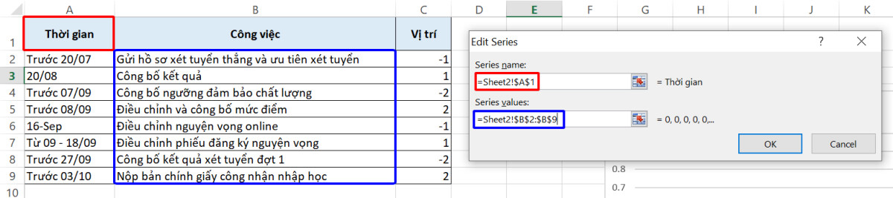
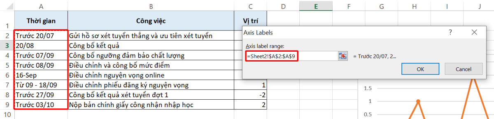
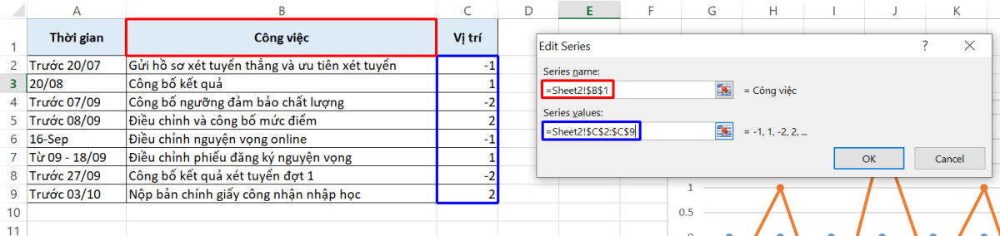

# 10 biểu đồ Excel nâng cao ai cũng cần biết

## 10 biểu đồ Excel nâng cao ai cũng cần biết

Biểu đồ trong Excel là công cụ tuyệt vời để trực quan hóa dữ liệu trang tính. Tuy nhiên, nếu bạn chỉ sử dụng các biểu đồ có sẵn, rất có thể bạn chưa khám phá hết sự lợi hại của công cụ này đâu. Vậy thì hãy cùng Gitiho học cách vẽ 10 **biểu đồ Excel nâng cao** hữu dụng nhất cho công việc biểu diễn số liệu trong bài [học Excel](https://gitiho.com/khoa-hoc/exg01-tuyet-dinh-excel-tro-thanh-bac-thay-excel-trong-16-gio-2) dưới đây nhé.

### Giới thiệu về biểu đồ Excel nâng cao 

Thông thường, thao tác vẽ biểu đồ Excel vô cùng đơn giản khi tất cả những gì chúng ta cần làm là chọn bảng dữ liệu và nhấn vào loại biểu đồ cần sử dụng. Vậy giả sử chúng ta không cần biểu đồ cột, biểu đồ đường hay biểu đồ tròn, mà lại tìm kiếm một loại biểu đồ khác thì sao? Tất cả các loại biểu đồ trong Excel không có sẵn đó sẽ được chúng mình đưa vào nhóm **biểu đồ Excel nâng cao**.

Để vẽ biểu đồ Excel trong nhóm này, các bạn sẽ cần tốn nhiều công sức hơn một chút, thực hiện nhiều thao tác hơn một chút. Tuy nhiên, chất lượng biểu diễn số liệu sẽ tăng lên nhiều lần khi bạn sử dụng đúng loại biểu đồ đúng không nào? Bạn đừng lo lắng quá, vì các thao tác tạo **biểu đồ Excel nâng cao** không hề phức tạp như bạn nghĩ đâu. Không tin thì cùng tìm hiểu ngay nhé.

Nếu chưa nắm vững kỹ năng vẽ các loại biểu đồ cơ bản như biểu đồ cột, biểu đồ đường và biểu đồ tròn thì các bạn hãy dành thời gian tham khảo bài viết dưới đây để thực hành làm quen với công cụ biểu đồ trong Excel nhé.

> Xem thêm: [Hướng dẫn cách để tạo biểu đồ trong Excel: Các dạng và ví dụ](https://gitiho.com/blog/huong-dan-cach-de-tao-bieu-do-trong-excel-cac-dang-va-vi-du.html)

### Biểu đồ so sánh dạng cột lồng nhau 

#### Mục đích sử dụng biểu đồ so sánh 

Biểu đồ cột lồng nhau được sử dụng với mục đích chính là biểu diễn tình hình thực hiện kế hoạch. Một ứng dụng phổ biến của biểu đồ cột lồng nhau chính là biểu diễn số liệu thực tế (số thực tế) đặt trong tương quan với KPI (số kế hoạch) của nhân viên. Có thể nói, loại biểu đồ so sánh này là một phương pháp đánh giá hiệu quả thực hiện công việc một cách trực quan hơn rất nhiều so với việc bạn chỉ nhìn qua các con số.

#### Cách vẽ biểu đồ so sánh 

Để vẽ biểu đồ so sánh dạng cột lồng nhau trong Excel, đầu tiên chúng ta cần có một bảng dữ liệu tổng hợp gồm 3 phần trả lời lần lượt các câu hỏi sua:

* _Chỉ tiêu, đối tượng_: Chúng ta cần đánh giá chỉ tiêu nào?
* _Số kế hoạch_: KPI cho đối tượng đó là bao nhiêu?
* _Số thực tế_: Chúng ta đã làm được bao nhiêu?

Giả sử chúng ta có một bảng báo cáo tình hình thực hiện kế hoạch theo KPI như hình dưới đây. Dựa vào bảng dữ liệu này, chúng ta sẽ tiến hành vẽ biểu đồ Excel nâng cao bằng cách sử dụng biểu đồ cột Clustered Column.

_**Bước 1**_**: Vẽ biểu đồ Excel dạng cột (Clustered Column)**

Bạn hãy chọn toàn bộ dữ liệu trong bảng báo cáo (trừ dòng tiêu đề), đi đến thẻ Insert > nhóm Charts > biểu tượng biểu đồ cột > Clustered Column. Chúng ta sẽ có biểu đồ trong Excel như sau với cột xanh biểu diễn KPI và cột cam biểu diễn số thực tế.

<figure><figcaption></figcaption></figure>

\
&#x20;

_**Bước 2**_**: Thay đổi dạng biểu đồ**

Bạn nhấn chuột phải tại biểu đồ Excel đã tạo và chọn Change Series Chart Type. Khi hộp thoại Change Chart Type hiện lên, bạn vào phần Combo tại bên trái hộp thoại và tích chọn ô Secondary Axis tương ứng với số liệu Thực tế.

<figure><figcaption></figcaption></figure>

&#x20;

_**Bước 3**_**: Điều chỉnh thang đo trục tung**

Bạn sẽ thấy biểu đồ so sánh của chúng ta có 2 trục tung với 2 thước đo khác nhau. Tại đây, các bạn hãy nhớ kỹ nguyên tắc: _Điều chỉnh trục có số nhỏ hơn_. Do số lớn nhất ở trục tung bên phải nhỏ hơn số lớn nhất ở trục tung bên trái, chúng ta sẽ thực hiện đồng nhất thang đo 2 trục tung với trục bên phải.

Bạn hãy nhấn chuột phải tại trục tung bên phải và chọn Format Axis, sau đó điền các thông số Minimum và Maximum tương ứng với trục tung bên trái.

<figure><figcaption></figcaption></figure>

_**Bước 4**_**: Điều chỉnh kích cỡ cột**

Bước cuối cùng chúng ta cần làm là điều chỉnh kích thước các cột của biểu đồ so sánh trong Excel sao cho cột Thực tế sẽ lồng ra ngoài cột Kế hoạch.

Để làm được điều này, các bạn hãy nhấn chuột phải tại cột Thực tế (cột xanh) và nhấn Format Data Series. Sau đó, tại mục Gap Width, điều chỉnh chiều rộng cột ở mức mong muốn. Lưu ý rằng số càng nhỏ thì thân cột sẽ càng lớn.

<figure><figcaption></figcaption></figure>

&#x20;

Như vậy, chúng ta đã hoàn thành một **biểu đồ Excel nâng cao** dạng cột lồng nhau rồi. Với biểu đồ so sánh này, các bạn có thể dễ dàng thấy được tương quan giữa thực tế làm việc và KPI.

<figure><figcaption></figcaption></figure>

> Xem thêm: [Hướng dẫn vẽ biểu đồ so sánh trong Excel dạng cột lồng nhau](https://gitiho.com/blog/huong-dan-ve-bieu-do-so-sanh-trong-excel-dang-cot-long-nhau.html)\
> &#x20;

### Biểu đồ Milestone 

#### Mục đích sử dụng biểu đồ Milestone 

Biểu đồ Milestone tập trung vào các mốc thời gian cụ thể diễn ra một hoạt động trong timeline (dòng thời gian) của một dự án. Dựa vào đó, chúng ta có thể đánh dấu cột mốc hoàn thành của các bước quan trọn trong quá trình thực hiện dự án.

#### Cách vẽ biểu đồ Milestone 

Chúng ta sẽ cần một bảng dữ liệu với mốc thời gian và công việc trong dự án để biểu diễn trên biểu đồ Milestone. Tại bảng, chúng ta sẽ có thêm một cột Vị trí để xác định dòng chú thích công việc của cột mốc sẽ hiện phía trên hay phía dưới đường thời gian. Bạn có thể chọn bất kì số âm (dữ liệu nằm phía dưới đường thời gian) hoặc số dương (dữ liệu nằm phía trên dường thời gian).

<figure><figcaption></figcaption></figure>

_**Bước 1**_**: Vẽ biểu đồ Excel dạng đường**

Không cần chọn trước dữ liệu, bạn hãy vào thẻ Insert và tạo ngay một biểu đồ đường Line with Markers.

Trên trang trống của biểu đồ hiện tại, chúng ta nhấn chuột phải và chọn Select Data. Tại phần Legend Entries, nhấn Add để thêm một chú thích (legend) và nhập các dữ liệu vào các mục tương ứng trong hộp thoại Edit Series. Đầu tiên chúng ta sẽ tạo đường thời gian.

<figure><figcaption></figcaption></figure>

Sau đó chúng ta nhấn OK để trở về hộp thoại Select Data Source. Hãy nhìn sang phần Horizontal (Category) Axis Label và nhấn Edit, chọn phạm vi dữ liệu các mốc thời gian (A2:A9) và nhấn OK.

<figure><figcaption></figcaption></figure>

Chúng ta đã hoàn thành legend cho đường thời gian. Bây giờ chúng ta sẽ tạo một legend mới cho các công việc tương ứng bằng cách nhấn Add tại mục Legend Entries. Lần này, chúng ta sẽ chèn dữ liệu như sau:

<figure><figcaption></figcaption></figure>

_**Bước 2: Đổi dạng biểu đồ**_

Lúc này biểu đồ trong Excel của chúng ta hiển thị như dưới đây.

<figure><figcaption></figcaption></figure>

Chúng ta sẽ chuyển đường màu cam về dạng cột bằng cách nhấn chuột phải tại đường và chọn Change Series Chart Type. Tại đây, bạn chọn dạng cột Clustered Column cho dữ liệu Công việc và nhấn OK.

<figure><figcaption></figcaption></figure>

_**Bước 3: Biểu diễn các công việc tương ứng với các mốc thời gian**_

Bước tiếp theo, chúng ta nhấn chuột phải tại cột Công việc và chọn Format Data Series. Hãy tích vào ô Secondary Axis, bạn sẽ thấy đường thời gian đã được chuyển xuống phía dưới và một trục tung bên phải được thêm vào **biểu đồ Excel nâng cao**.

<figure><figcaption></figcaption></figure>

Thực tế, chúng ta không cần đến trục tung mới này, nên bạn hãy nhấn chọn trục tung bên phải và xóa nó đi nhé. Ngay lập tức, đường thời gian sẽ trở về vị trí cũ.

Tiếp theo, bạn nhấn chuột phải tại cột Công việc và chọn Add Data Labels. Các số liệu của cột sẽ hiện lên như trong hình.

<figure><figcaption></figcaption></figure>

Việc chúng ta cần làm lúc này là thay đổi các con số vô nghĩa kia về công việc tương ứng với mốc thời gian. Để thực hiện thao tác này, bạn hãy nhấn chuột phải vào các cột và chọn Format Data Labels, tích chọn Category name.

<figure><figcaption></figcaption></figure>

_**Bước 4: Thay các bằng thành các đoạn thẳng**_

Bạn hãy nhấn vào biểu đồ, tiến đến thẻ Design > nhóm Chart Layouts > Add Chart Element > Error Bars > Standard Error. Các đoạn thẳng sẽ xuất hiện tại vị trí các cột Công việc trong biểu đồ Excel hiện tại. Bạn nhấn chuột phải tại các đoạn thẳng này, chọn Format Error Bars và tích chọn các mục Minus, No cap và Percentage đặt 100%.

<figure><figcaption></figcaption></figure>

Sau khi đóng cửa sổ Format Error Bars, chúng ta sẽ nhấn chuột phải tại các cột và chọn Format Data Series. Tại mục Fill, bạn hãy chọn No fill. Tại mục Border, chọn No line để **biểu đồ Excel nâng cao** không còn hiển thị các cột nữa.

<figure><figcaption></figcaption></figure>

Vậy là chúng ta đã hoàn thành một biểu đồ Milestone rồi.

<figure><figcaption></figcaption></figure>

> Xem thêm: [Hướng dẫn tạo biểu đồ Milestones trong Excel](https://gitiho.com/blog/huong-dan-tao-bieu-do-milestones-trong-excel.html)

### Biểu đồ Gantt 

#### Mục đích sử dụng biểu đồ Gantt 

Bên cạnh biểu đồ Milestone ở trên, một công cụ không thể thiếu trong các dự án chính là biểu đồ Gantt. Đây là loại biểu đồ trình bày các công việc theo thời gian. Tuy nhiên, khác với biểu đồ Milestone, biểu đồ Gantt được dùng để theo dõi tiến độ các công việc diễn ra trong quá trình thực hiện dự án, giúp quản lý dự án hiệu quả hơn.

#### Cách vẽ biểu đồ Gantt 

Chúng ta sẽ thực hành cách vẽ biểu đồ Gantt trong Excel với bảng dữ liệu dưới đây.

<figure><figcaption></figcaption></figure>

_**Bước 1: Vẽ biểu đồ Excel**_

Bạn hãy chọn dữ liệu trong cột Ngày bắt đầu (B2:B10) và đi tới thẻ Insert để vẽ biểu đồ Excel dạng Stacked Bar.

<figure><figcaption></figcaption></figure>

_**Bước 2: Thêm dữ liệu vào biểu đồ**_

Để thêm dữ liệu thời gian vào biểu đồ Excel, nhấn chuột phải vào biểu đồ rồi chọn Select Data  Hộp thoại Select Data Source hiện lên, bạn hãy nhấn Add tại phần Legend Entries (Series) và nhập các dữ liệu như sau:

<figure><figcaption></figcaption></figure>

Sau đó, nhấn OK để hoàn tất thêm dữ liệu. Tiếp theo, chúng ta sẽ thêm các công việc vào biểu đồ trong Excel. Hãy chọn mục Ngày bắt đầu (mục đầu tiên) tại phần Legend Entries (Series), chuyển sang phần Horizontal (Category) Axis Label và nhấn Edit.

Tại hộp thoại Axis Labels, hãy chọn toàn bộ dữ liệu Công việc (A3:A10) rồi nhấn OK.

<figure><figcaption></figcaption></figure>

_**Bước 3: Định dạng biểu đồ Gantt**_

Hãy nhìn kỹ biểu đồ Excel hiện tại của chúng ta nhé. Bạn có phát hiện ra điều bất hợp lý không? Các công việc hiển thị trên biểu đồ đang bị ngược so với trình tự trong bảng dữ liệu bên cạnh.

<figure><figcaption></figcaption></figure>

Để đưa các công việc về đúng trình tự thời gian, bạn chỉ cần nhấn chuột phải tại các danh mục này trong **biểu đồ Excel nâng cao** vừa tạo, chọn Format Axis và tích chọn ô Categories in reverse order.

<figure><figcaption></figcaption></figure>

Giờ thì biểu các công việc đã được sắp xếp theo đúng thứ tự rồi, chúng ta sẽ định dạng biểu đồ này sao cho đúng với một biểu đồ Gantt bằng cách xóa bỏ phần thanh màu xanh. Hãy nhấn chuột phải tại phần cần xóa, chọn Format Data Series.

Tại cửa sổ bên phải màn hình, bạn hãy nhấn vào biểu tượng thùng sơn và tích chọn các ô No fill và No border.

<figure><figcaption></figcaption></figure>

Vậy là đã xóa xong các phần màu xanh không cần thiết trong biểu đồ Gantt. Tuy nhiên, thao tác định dạng biểu đồ vẫn chưa kết thúc đâu nhé. Chúng ta còn phải điều chỉnh các mốc thời gian nữa đó. Cố gắng thêm chút nữa nào!

Để xử lý dữ liệu thời gian, bạn cần lưu ý rằng Excel lưu trữ ngày tháng dưới dạng các con số tự nhiên. Vậy nên việc bạn cần làm lúc này là tìm số tự nhiên đại diện cho ngày bắt đầu thực hiện công việc đầu tiên trong dự án. Hãy chọn ô dữ liệu đầu tiên trong cột Ngày bắt đầu, vào thẻ Home > Format Cells > General.

<figure><figcaption></figcaption></figure>

Excel cho biết ngày 01/01/2021 tương ứng với con số 44197. Bạn hãy ghi nhớ con số này và đưa ô tính quay trở lại định dạng ngày tháng ban đầu nhé.

Chúng ta sẽ tiến đến biểu đồ Excel, nhấn chuột phải tại trục ngày tháng và chọn Format Axis. Tại đây, bạn hãy điền con số đã ghi nhớ ở trên vào ô Minimum để đưa các thanh màu cam về mốc đầu tiên trong biểu đồ.

Ngoài ra, bạn có thể thiết lập các thông số tại mục Units để xác định khoảng cách giữa các mốc thời gian muốn hiển thị trên biểu đồ Gantt.

<figure><figcaption></figcaption></figure>

Thao tác cuối cùng để hoàn thiện biểu đồ trong Excel là xóa các khoảng trắng giữa các thanh màu cam. Hãy nhấn chuột phải tại các thanh này, kéo thông số Gap Width về 0.

<figure><figcaption></figcaption></figure>

Như vậy là bạn đã hoàn thành một biểu đồ Gantt đúng chất rồi! Với **biểu đồ Excel nâng cao** này, bạn hoàn toàn có thể thực hiện các thay đổi tự trong bảng dữ liệu mà không lo phải cập nhật vào biểu đồ, bởi Excel sẽ tự động làm điều đó thay bạn.

> Xem thêm: [Hướng dẫn tạo biểu đồ Gantt trong Excel bằng Conditional Formatting](https://gitiho.com/blog/huong-dan-tao-bieu-do-gantt-trong-excel-bang-conditional-formatting.html)

Trong phần 1 của series **biểu đồ Excel nâng cao**, chúng ta đã thực hành cách vẽ biểu đồ Excel dạng cột lồng nhau, biểu đồ Milestone và biểu đồ Gantt. Nếu các bạn đã nắm vững kiến thức về 3 loại biểu đồ Excel này, hãy cùng Gitiho khám phá các biểu đồ tiếp theo ngay thôi nào!

### Biểu đồ Excel nâng cao: Đường cong chuông 

#### Mục đích sử dụng đường cong chuông 

Được sử dụng phổ biến trong lĩnh vực thống kê, đường cong chuông (Bell curve) là đường biểu diễn phân phối chuẩn (normal distribution) với hình dạng cân đối như một quả chuông. Loại phân phối này thể hiện xác suất xảy ra các biến, với điểm cao nhất trên đỉnh chuông đại diện cho sự kiến có xác suất xảy ra cao nhất và các điểm trên thân chuông tương ứng với các xác suất thấp dần đến điểm rìa chuông. Độ rộng của đường cong chuông phụ thuộc vào độ lệch chuẩn của dữ liệu.

**Biểu đồ Excel nâng cao** này còn có nhiều ứng dụng khác. Các nhà đầu tư tài chính sử dụng đường cong chuông để đo lường mức độ lợi nhuận của chứng khoán hoặc độ nhạy của thị trường. Dựa vào biến động được thể hiện bởi chỉ số độ lệch chuẩn, các nhà đầu tư có thể đưa ra các giả định về xu hướng lợi nhuận với các loại cổ phiếu của mình trong tương lai. Mặt khác, các trường học hoặc các công ty có thể sử dụng đường cong chuông để đánh giá kết quả học tập của học sinh hoặc hiệu suất làm việc của nhân viên.

#### Cách vẽ đường cong chuông 

So với các cách vẽ biểu đồ trong Excel nâng cao chúng ta đã tìm hiểu trong phần trước, đường cong chuông có vẻ đơn giản hơn rất nhiều. Giả sử chúng ta có một bảng tổng hợp điểm của 12 em học sinh như dưới đây:

&#x20;

<figure><figcaption></figcaption></figure>

_**Bước 1: Tính trung bình và độ lệch chuẩn**_

Trước khi bắt đầu, các bạn hãy sắp xếp các thành phần trong bảng dữ liệu theo thứ tự từ thấp đên cao bằng cách chọn toàn bộ cột Điểm, đi đến thẻ Data > nhóm Sort & Filter > Sort. Bảng trong hình trên đã được sắp xếp theo thứ tự nên mình không thực hiện lại thao tác này nữa.

Bây giờ chúng ta sẽ thực hiện tính trung bình (mean) và độ lệch chuẩn (standard deviation) cho các con số trong bảng. Công thức tính toán đơn giản như sau:

* Trung bình: **=AVERAGE(B2:B12)**
* Độ lệch chuẩn: **=STDEV.P(B2:B12)**

<figure><figcaption></figcaption></figure>

_**Bước 2: Xác định xác suất**_

Dựa vào các giá trị trung bình và độ lệch chuẩn đã tính ở trên, chúng ta sẽ tạo một cột mới bên phải cột B để tìm xác suất theo phân phối chuẩn của từng giá trị tại cột Điểm. Hàm tính toán hỗ trợ chúng ta thực hiện thao tác này chính là hàm NORM.DIST với công thức như sau:

**=NORM.DIST(B2,$F$2,$F$3,FALSE)**

Vậy là chúng ta đã hoàn thành bảng dữ liệu trong hình dưới đây.

<figure><figcaption></figcaption></figure>

_**Bước 3: Vẽ đường hình chuông**_

Chúng ta sẽ áp dụng cách vẽ biểu đồ histogram trong Excel để vẽ đường cong chuông. Tất cả những gì bạn cần làm là đi đến thẻ Insert > nhóm Charts > biểu tượng biểu đồ phân tán > Scatter with Smooth Lines and Markers. Vậy là chúng ta đã hoàn thành đường cong chuông trong Excel rồi.

<figure><figcaption></figcaption></figure>

### Biểu đồ Excel nâng cao: Biểu đồ hình phễu 

#### Mục đích sử dụng biểu đồ hình phễu 

Biểu đồ hình phễu biểu diễn các giá trị tương ứng với các giai đoạn được chia ra trong một quy trình. Thông thường, loại **biểu đồ Excel nâng cao** này được sử dụng để hiển thị số tiền yêu cầu đối với từng giai đoạn bán hàng. Ngoài ra, biểu đồ hình phễu còn thể hiện các vấn đề có thể xảy ra trong quá trình bán hàng.

#### Cách tạo biểu đồ hình phễu 

Giả sử chúng ta có một bảng dữ liệu như sau:

<figure><figcaption></figcaption></figure>

_**Bước 1: Xác định khoảng cách cân bằng**_

Như chúng ta đã biết, biểu đồ Excel hình phễu đòi hỏi sự cân bằng về mặt hình học giữa các phần của biểu đồ. Do đó, chúng ta cần phải xác định khoảng cách đến điểm cân bằng này. Đầu tiên, hãy chèn thêm 1 cột mới bên trái cột B. Mình sẽ đặt tên cột là Khoảng cách cân bằng.

Tại ô đầu tiên của cột (ô B2) tương ứng với giai đoạn Khách hàng tiềm năng và số tiền 500, chúng ta sẽ nhập số 0 vì đây là phần phễu lớn nhất, gắn liền với trục tung. Tại các ô tiếp theo, chúng ta sẽ sử dụng hàm LARGE để xác định khoảng cách giữa các phần đến điểm cân bằng trong đồ thị Excel.

**=(LARGE($C$2:$C$7,1)-C3)/2**

<figure><figcaption></figcaption></figure>

&#x20;

_Bước 2: Vẽ biểu đồ hình phễu_

Bạn hãy chọn toàn bộ phạm vi chứa dữ liệu cần đưa lên biểu đồ (A2:C7), đi đến thẻ Insert > nhóm Charts > biểu tượng biểu đồ thanh > Stacked Bar. Bạn sẽ có một biểu đồ như sau:

<figure><figcaption></figcaption></figure>

Bạn có nhận ra điểm bất thường trong biểu đồ này không? Hình như chiếc phễu của chúng ta đã bị úp ngược mất rồi. Các bạn hãy nhấn vào phần ghi chú giai đoạn trên biểu đồ Excel, chọn Format Axis và tích chọn ô Categories in reverse order để đảo ngược thứ tự các giai đoạn nhé.

<figure><figcaption></figcaption></figure>

Giờ thì biểu đồ Excel của chúng ta đã được đưa về đúng trình tự thời gian rồi.

_**Bước 3: Định dạng biểu đồ**_

Thao tác định dạng đầu tiên chúng ta cần làm chính là loại bỏ phần thanh màu xanh, chỉ để hiển thị phần thanh màu cam. Để làm được điều này, hãy nhấn chuột phải tại phần cần xóa, chọn Format Data Series, lần lượt tích No fill trong mục Fill và No line trong mục Border.

<figure><figcaption></figcaption></figure>

_Bước 4: Ghép các thanh về đúng hình dạng phễu_

Nếu bạn muốn Excel hiển thị các số liệu chi tiết trên từng phần biểu đồ hình phễu, hãy nhấn chuột phải tại một thanh màu cam và chọn Add Data Label. Lúc này, các con số tại cột Số tiền sẽ hiện lên **trên biểu đồ Excel nâng cao**.

<figure><figcaption></figcaption></figure>

Bước cuối cùng để hoàn thiện cách vẽ biểu đồ trong Excel nâng cao là phóng to các thanh màu cam để hình phễu của chúng ta không còn bị hở một chỗ nào. Các bạn hãy nhấn chuột phải tại một thanh màu cam và chọn Format Data Series.

Tại đây, các bạn chỉ cần kéo thông số Gap Width về xuống 0% là đã hoàn thành rồi.

<figure><figcaption></figcaption></figure>

Kết quả là chúng ta có được một biểu đồ hình phễu hoàn chỉnh như sau:

<figure><figcaption></figcaption></figure>

Xem thêm: [Cách tạo biểu đồ phễu (Funnel charts) trong Google Sheets](https://gitiho.com/blog/cach-tao-bieu-do-pheu-funnel-charts-trong-google-sheets-1879.html)

### Biểu đồ Excel nâng cao: Biểu đồ Pareto 

#### Mục đích sử dụng biểu đồ Pareto 

Dựa trên quy luật Pareto (quy luật 80/20), biểu đồ Pareto được sử dụng chủ yếu trong lĩnh vực quản lý chất lượng và quản lý dự án. Để giải thích về quy luật này, bạn có thể hiểu đơn giản như sau: Khoảng 80% kết quả đến từ 20% nguyên nhân gây ra. Ví dụ: 80% doanh thu đến từ 20% khách hàng.

Biểu đồ Pareto sẽ trở nên vô cùng hữu dụng khi bạn là quản lý dự án và bạn cần xác định nguyên nhân xảy ra sự cố trong một hoạt động nhất định.

#### Cách vẽ biểu đồ Pareto 

Chúng ta sẽ cùng thực hành vẽ biểu đồ trong Excel nâng cao với một bảng dữ liệu dưới đây:

<figure><figcaption></figcaption></figure>

_**Bước 1: Tính tổng cộng dồn**_

Đầu tiên, chúng ta sẽ thêm vào bên phải cột B một cột mới để tính tổng cộng dồn lượng phản hồi theo đơn vị phần trăm, nghĩa là với nguyên nhân cuối cùng trong bảng, con số đưa ra sẽ là 100%.

Công thức hàm tính toán của chúng ta tại ô C3 trong trường hợp này như sau:

**=SUM($B$3:B3)/SUM($B$3:$B$11)**

<figure><figcaption></figcaption></figure>

&#x20;

_Bước 2: Vẽ biểu đồ cột_

Hãy chọn toàn bộ phạm vi dữ liệu cần đưa lên biểu đồ (A3:C11) và đi tới thẻ Insert > nhóm Charts > biểu tượng biểu đồ cột > Clustered Column.

Phần mềm sẽ vẽ cho chúng ta một biểu đồ Excel đơn giản như sau:

<figure><figcaption></figcaption></figure>

_Bước 3: Vẽ biểu đồ Pareto_

Với biểu đồ trên, chúng ta sẽ chuyển các cột màu cam về dạng đường để đúng với định dạng biểu đồ Pareto. Hãy nhấn chuột phải tại bất kỳ cột nào trên biểu đồ Excel và chọn Change Series Chart Type.

Hộp thoại Change Chart Type hiện lên. Bạn hãy đổi Chart Type của dữ liệu Cộng dồn sang dạng Line và tích chọn ô Secondary Axis.

<figure><figcaption></figcaption></figure>

Bây giờ thì biểu đồ Pareto của chúng ta đã gần hoàn chỉnh rồi.

_**Bước 4: Điều chỉnh thông số trục tung**_

Bạn sẽ để ý rằng trục tung bên phải đang hiển thị giá trị cao nhất là 120%. Điều này hoàn toàn không cần thiết vì số liệu của chúng ta dừng lại ở mức 100%. Chính vì vậy, hãy điều chỉnh thông số bằng cách nhấn chuột tại trục tung, chọn Format Axis. Sau đó, điền 1 (bằng với 100%) vào ô Maximum và thay đổi thông số Major thành 0.2 (bằng với 20%) để hiển thị các mốc trên trục tung cách nhau 20%.

<figure><figcaption></figcaption></figure>

Và đây là thành quả biểu đồ Pareto của chúng ta. Vậy là bạn đã học thêm được một **biểu đồ Excel nâng cao** nữa rồi đó.

<figure><figcaption></figcaption></figure>

> Xem thêm: [Hướng dẫn vẽ biểu đồ Pareto nguyên lý 80-20 trên Excel](https://gitiho.com/blog/huong-dan-ve-bieu-do-pareto-nguyen-ly-80-20-tren-excel.html)

### Biểu đồ Excel nâng cao: Biểu đồ hình đạn 

#### Mục đích sử dụng biểu đồ hình đạn 

Trong phần đầu tiên của series 10 **biểu đồ Excel nâng cao**, chúng ta đã tìm hiểu về biểu đồ so sánh trong Excel dạng cột lồng nhau. Tương tự như vậy, biểu đồ hình đạn (bullet chart) là một biến thể của biểu đồ cột với mục đích đánh giá mức độ hoàn thiện kế hoạch dựa vào các cường độ màu sắc được thể hiện trong cột. Với công dụng của mình, biểu đồ hình đạn thường được sử dụng trong các báo cáo tổng hợp.

#### Cách vẽ biểu đồ hình đạn 

Chúng ta sẽ thực hành cách vẽ biểu đồ hình đạn với bảng dữ liệu dưới đây. Bên cạnh là kết quả vẽ biểu đồ Excel nâng cao chúng ta sẽ đạt được qua hướng dẫn. Cùng thực hành ngay thôi nào!

 

_**Bước 1: Vẽ biểu đồ cột**_

Chúng ta sẽ chọn toàn bộ dữ liệu đưa lên biểu đồ (A2:B7) và đi tới thẻ Insert > nhóm Charts > biểu tượng biểu đồ cột > Stacked Column.

Excel sẽ vẽ ra một biểu đồ như sau:

<figure><figcaption></figcaption></figure>

Việc cần làm lúc này là đưa các cột trên biểu đồ về làm 1 cột duy nhất. Bạn hãy nhấn chuột chọn phần chú thích phía dưới cột, vào thẻ Design > nhóm Data > Switch Row/Column. Biểu đồ Excel của bạn đã được hợp nhất thành 1 cột.

<figure><figcaption></figcaption></figure>

&#x20;

_Bước 2: Tạo vạch Mục tiêu_

Để biến giá trị Mục tiêu trên biểu đồ từ dạng cột sang dạng vạch kẻ, đầu tiên chúng ta sẽ nhấn chuột phải tại cột biểu diễn Mục tiêu (cột xanh lá), chọn Change Series Chart Type.

Tại hộp thoại Change Chart Type, bạn hãy lướt xuống dưới để tìm giá trị Mục tiêu, thay đổi Chart Tyoe thành Stacked Line with Markers và tích chọn ô Secondary Axis. Lúc này, cột Mục tiêu sẽ được thay thế bằng dấu chấm nhỏ màu xanh lá.

<figure><figcaption></figcaption></figure>

Bạn sẽ để ý rằng **biểu đồ Excel nâng cao** hiện tại có 2 trục tung và chấm xanh thể hiện Mục tiêu đang tương ứng với mức 90% theo trục tung bên phải. Tuy nhiên, chúng ta không cần đến trục tung mới này. Do đó, bạn hãy xóa nó đi và chấm xanh sẽ tự động trở về vị trí đúng theo trục tung bên trái.

Thao tác tiếp theo là biến dấu chấm này thành vạch bằng cách nhấn chuột phải tại đối tượng, chọn Format Data Series. Tại phần Marker, hãy tích chọn ô Built-in, chọn hình vạch ngang trong danh sách Type và điều chỉnh kích cỡ vạch theo mong muốn. Ở đây, mình đặt Size là 20.

Ngoài ra, bạn cũng có thể thay đổi màu của vạch ngang tại phần Fill phía dưới.

<figure><figcaption></figcaption></figure>

_**Bước 3: Điều chỉnh cột Giá trị thực tế**_

Sau khi đã xử lý giá trị Mục tiêu trên biểu đồ, chúng ta sẽ chuyển sang cột Giá trị thực tế. Hãy nhấn chuột phải tại cột này (cột xanh dương đậm), chọn Change Series Chart Type.&#x20;

Tại hộp thoại Change Chart Type, bạn hãy tích chọn ô Secondary Axis tương ứng với Giá trị thực tế.

<figure><figcaption></figcaption></figure>

Như vậy, cột Giá trị thực tế đã được đặt đúng vị trí tương ứng với 85% theo trục tung. Chúng ta sẽ thu nhỏ cột lại bằng cách nhấn chuột phải tại cột, chọn Format Data Series, phóng to Gap Width lên 500%.

<figure><figcaption></figcaption></figure>

_**Bước 4: Tô màu các thang đo**_

Bước cuối cùng hoàn thiện cách vẽ biểu đồ trong Excel nâng cao của chúng ta là tô màu các cột thang đo phía sau cột Giá trị thực tế và vạch Mục tiêu. Giữ nguyên cửa sổ Format Data Series từ bước trước, bạn chỉ cần lần lượt nhấn vào từng cột giá trị thang đo và đổi màu chúng.

<figure><figcaption></figcaption></figure>

Vậy là chúng ta đã vẽ xong biểu đồ so sánh trong Excel hình đạn rồi.

> Xem thêm: [Hướng dẫn vẽ biểu đồ so sánh trong Excel dạng cột lồng nhau](https://gitiho.com/blog/huong-dan-ve-bieu-do-so-sanh-trong-excel-dang-cot-long-nhau.html)

### Biểu đồ Excel nâng cao: Biểu đồ bước 

#### Mục đích sử dụng biểu đồ bước 

Biểu đồ bước được sử dụng để thể hiện các thay đôi diễn ra trong các khoảng thời gian không đều. Dữ liệu trong biểu đồ bước có xu hướng ổn định trong một giai đoạn, sau đó các thay đổi mới bắt đầu xảy ra. Không giống như biểu đồ đường thông thường, biểu đồ bước thể hiện dữ liệu qua các đường ngang và thẳng đứng.

Nếu bạn đang đặt ra câu hỏi: Tại sao không dùng luôn biểu đồ đường? Hãy nhìn vào hình dưới đây và bạn sẽ nhận ra lí do.

<figure><figcaption></figcaption></figure>

Tại phần khoanh đỏ trong biểu đồ đường, bạn sẽ chỉ thấy giá trị tăng liên tục từ tháng 05/2015 đến tháng 06/2015. Tuy nhiên, hãy nhìn sang biểu đồ bước để thấy sự khác biệt. Trên thực tế, dữ liệu có sự tăng vọt tại 2 mốc thời gian chứ không phải tăng liên tục như những gì thể hiện trong biểu đồ đường.

#### Cách vẽ biểu đồ bước 

Chúng ta có một bảng dữ liệu như sau:

<figure><figcaption></figcaption></figure>

_**Bước 1: Xử lý bảng số liệu**_

Cách vẽ biểu đồ trong Excel nâng cao này vô cùng đơn giản. Chúng ta bắt đầu với bước copy paste bảng dữ liệu trên sang các cột bên cạnh như sau:

<figure><figcaption></figcaption></figure>

Tại cuối bảng dữ liệu mới, chúng ta sẽ tiếp tục copy paste toàn bộ số liệu từ bảng dữ liệu gốc.

<figure><figcaption></figcaption></figure>

_**Bước 2: Vẽ biểu đồ bước**_

Hãy chọn toàn bộ số liệu tại bảng dữ liệu mới và đi đến thẻ Insert > nhóm Charts > biểu tượng biểu đồ đường > Line.&#x20;

Biểu đồ Excel của chúng ta hiện ra như sau:

<figure><figcaption></figcaption></figure>

Vậy là bạn đã hoàn thành vẽ biểu đồ trong Excel nâng cao rồi. Thật đơn giản phải không nào?

### Biểu đồ Excel nâng cao: Biểu đồ Waffle 

#### Mục đích sử dụng biểu đồ Waffle 

Biểu đồ Waffle là một loại biểu đồ lưới ô 10x10, trong đó các ô được tô màu thể hiện giá trị phần trăm của số liệu tương ứng. Loại biểu đồ Excel này được sử dụng phổ biến trong các báo cáo tổng hợp. Giả sử như đánh giá tỷ lệ hoàn thành lao động, tỷ lệ lao động chất lượng cao,...

#### Cách vẽ biểu đồ Waffle 

Khác với các loại **biểu đồ Excel nâng cao** chúng ta đã thực hành phía trên, biểu đồ Waffle không được tạo từ công cụ biểu đồ trong Excel. Thay vào đó, chúng ta sẽ sử dụng công cụ Conditional Formatting.

_**Bước 1: Kẻ biểu đồ Waffle**_

Hãy kẻ một bảng 10x10 trên trang tính Excel của bạn, kèm theo ô nhập dữ liệu mức độ hoàn thiện như trong hình dưới đây:\
&#x20;

<figure><figcaption></figcaption></figure>

Chúng ta sẽ điền lần lượt từ 1-100% vào các ô trong biểu đồ Waffle, bắt đầu từ ô cuối cùng bên trái (ô E11). Bạn có thể điền số liệu bằng tay, hoặc sử dụng công thức dưới đây cho ô E11:

**=(COLUMNS($E11:E$11)+10\*(ROWS($E11:E$11)-1))/100**

Sau đó, hãy kéo công thức để áp dụng cho toàn bộ các ô trong lưới. Chúng ta có một biểu đồ Excel như sau:

<figure><figcaption></figcaption></figure>

Để chuyển đổi định dạng các số thập phân này về phần trăm, bạn hãy chọn toàn bộ lưới và đi đến thẻ Home > nhóm Number > ký tự %.

<figure><figcaption></figcaption></figure>

_**Bước 2: Áp dụng Conditional Formatting**_

Hãy chọn toàn bộ phạm vi lưới từ 1-100%, đi đến thẻ Home > nhóm Styles > Conditional Formatting > New Rule. Tại đây chúng ta sẽ tiến hành thiết lập điều kiện tô màu các ô trong biểu đồ Waffle như sau:

<figure><figcaption></figcaption></figure>

Đối với phần Format, bạn hãy chọn màu font trùng với màu ô để tô cả ô tính màu vàng như trong hình nhé. Sau khi nhấn OK và áp dụng Conditional Formatting, **biểu đồ Excel nâng cao** của chúng ta sẽ hiển thị như sau:

<figure><figcaption></figcaption></figure>

Vậy là chúng ta đã thiết lập điều kiện tô màu biểu đồ Waffle thành công. Để các ô tính còn lại trong lưới không hiển thị số liệu, bạn chỉ cần chọn toàn bộ lưới rồi áp dụng cùng một màu cho chữ và ô tính là được.

<figure><figcaption></figcaption></figure>

_Bước 3: Hiển thị phần trăm trên biểu đồ_

Để hoàn thiện công việc vẽ biểu đồ trong Excel nâng cao này, chúng ta sẽ thêm một dòng chữ vào lưới để thể hiện số liệu phần trăm đang hiển thị. Bạn hãy vào thẻ Insert > nhóm Text > Text Box > Horizontal Text Box để tạo một hộp thoại nội dung đặt vào vị trí mong muốn trong biểu đồ Waffle.

Sau đó, điền tham chiếu đến ô hiển thị mức độ hoàn thành vào trong hộp thoại:

**=$C$2**

<figure><figcaption></figcaption></figure>

Cuối cùng, chúng ta định dạng lại hộp thoại không có màu nền và đường viền, đồng thời thay đổi font chữ hoặc kích thước, màu sắc văn bản theo ý muốn. Như vậy, chúng ta đã hoàn thành một biểu đồ Waffle trong Excel.

<figure><figcaption></figcaption></figure>

### Biểu đồ Excel nâng cao: Biểu đồ nhiệt kế 

#### Mục đích sử dụng biểu đồ nhiệt kế 

Thêm một biểu đồ Excel nữa được sử dụng để đo lường mức độ hoàn thành công việc. Đó chính là biểu đồ nhiệt kế. Nếu bạn cần đánh giá duy nhất một chỉ tiêu, biểu đồ này chính là sự lựa chọn phù hợp.

#### Cách vẽ biểu đồ nhiệt kế 

Chúng ta sẽ thực hiện cách vẽ biểu đồ Excel dưới đây với bảng dữ liệu như sau:

  

_**Bước 1: Vẽ biểu đồ cột**_

Hãy chọn các ô mức độ hoàn thành và KPI dưới định dạng phần trăm để đưa vào biểu đồ cột Clustered Column. Biểu đồ Excel của chúng ta sẽ bao gồm 2 cột tách rời.

<figure><figcaption></figcaption></figure>

Tiếp theo, chúng ta sẽ nhập 2 cột này làm một. Bạn nhấn chuột vào bất kỳ cột nào và đi tới thẻ Design > nhóm Data > Switch Row/Column.&#x20;

<figure><figcaption></figcaption></figure>

Tại cột màu cam, bạn nhấn chuột phải và chọn Format Data Series. Khi cửa sổ mới hiện lên bên phải màn hình, bạn hãy tích chuột vào ô Secondary Axis. Lúc này, 2 cột trên biểu đồ Excel sẽ hợp thành một.

<figure><figcaption></figcaption></figure>

Như bạn thấy, trên biểu đồ so sánh trong Excel lúc này xuất hiện 2 trục tung. Thực tế chúng ta không cần sử dụng đến trục tung bên phải nên có thể xóa nó đi. Tuy nhiên, trước khi thực hiện thao tác này, bạn hãy nhấn chuột phải tại trục tung bên trái và chọn Format Axis. Để giữ nguyên định dạng hiển thị trục tung bên trái, hãy nhập các thông số như trong hình và đảm bảo nút trạng thái bên cạnh đã chuyển từ Auto sang Reset.

<figure><figcaption></figcaption></figure>

Sau đó, bạn hãy xóa trục tung bên phải đi và chúng ta đã hoàn thành bước đầu tiên để vẽ biểu đồ trong Excel nâng cao.

<figure><figcaption></figcaption></figure>

_Bước 2: Định dạng cột_

Tại bước tiếp theo, chúng ta sẽ tạo hình cho chiếc nhiệt kế của biểu đồ Excel. Hãy nhấn chuột phải tại cột màu cam, chọn Format Data Series, tích No fill và Solid line. Vậy là chúng ta sẽ tạo một khung rỗng bao quanh cột màu xanh thể hiện mức độ hoàn thành công việc.&#x20;

<figure><figcaption></figcaption></figure>

Sau đó, nhấn chuột phải tại trục tung bên trái, chọn Format Axis. Tại phần Tick Marks, hãy lựa chọn Inside cho Major type. Bạn sẽ thấy bên cạnh trục tung xuất hiện một thang đo.

<figure><figcaption></figcaption></figure>

Để làm biến mất các hàng gióng cột màu xám, bạn chỉ cần nhấn chọn một hàng bất kỳ và nhấn nút Delete là đã hoàn thành thao tác xóa rồi. Về cơ bản, biểu đồ so sánh dạng nhiệt kế của bạn đã sẵn sàng để đưa lên báo cáo. Nhưng nếu có thời gian, hãy hoàn thiện bước cuối cùng dưới đây nhé.

_**Bước 3: Hoàn thiện hình dạng nhiệt kế**_

Bạn có thể thấy chiếc nhiệt kế đang thiếu một yếu tố gì đó. Hãy đi đến tab Insert > nhóm Illustrations > Shapes > Oval, sau đó nhấn giữ phím Shift để vẽ một hình tròn cho **biểu đồ Excel nâng cao** của chúng ta nhé.

Kết quả biểu đồ nhiệt kế trong Excel của bạn sẽ tương tự như hình dưới đây.&#x20;

<figure><figcaption></figcaption></figure>

&#x20;

Quả là một kết quả mỹ mãn đúng không nào? Chúng ta đã hoàn thành thao tác vẽ biểu đồ so sánh trong Excel dạng nhiệt kế rồi đó.

### Tổng kết 

Qua bài viết này, chúng ta đã thực hành 10 cách vẽ biểu đồ trong Excel nâng cao bao gồm biểu đồ hình đạn, biểu đồ bước, biểu đồ Waffle và cuối cùng là biểu đồ nhiệt kế. Hy vọng series 10 **biểu đồ Excel nâng cao** đã giúp các bạn tích lũy thêm các kiến thức hữu ích để áp dụng trong công việc của mình. Hãy tham khảo thêm các bài viết khác về chủ đề Excel trên blog Gitiho để nâng cao kỹ năng tin học văn phòng nhé.

